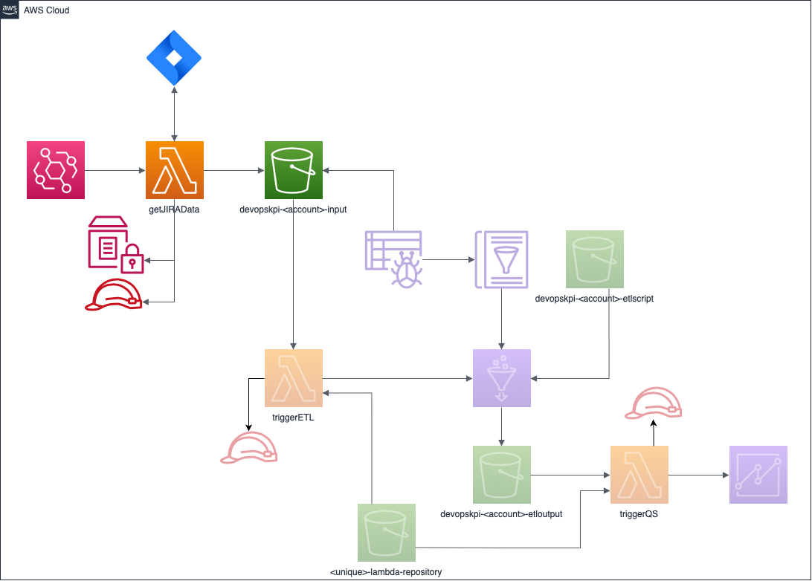

# getJIRAData

This project contains source code and supporting files for a serverless application that retrieves issues from JIRA based on a query specified in an AWS Systems Manager parameter store.  It uses the JIRA API pagination to iterate until it retrieve all of the results.  These are then written to an object in S3.

This is part 1 of an overall solution to provide DevOps Key Performance Indicators on a AWS QuickSight dashboard.
1. Retrieve the data (This repository)
1. [Transfor the data and perform the KPI calculation](https://github.com/Dazza65/triggerETL-Lambda)
1. Ingest the transformed data to QuickSight - Coming shortly

## Build and deploy

1. Clone the repository
1. Install the following dependencies
    1. Docker (v20.10.6)
    1. AWS CLI (v2.0.62)
    1. AWS SAM (v1.23.0)
1. sam build
1. sam deploy
1. Add values to the created system parameters (described below)

## The following AWS resources are created

1. Lambda function
1. System Manager - Parameter Store
    1. /getJIRAData/jql - Any valid JIRA JQL query.  In my instance I'm using the following: project = SSP AND type = Story AND status = Done
    1. /getJIRAData/site - Your JIRA instance domain name E.g a value of test would result in calls to https://test.atlassian.net
    1. /getJIRAData/token - Your API token value generated via http://id.atlassian.net See the [JIRA documentation](https://support.atlassian.com/atlassian-account/docs/manage-api-tokens-for-your-atlassian-account/) for more details
    1. /getJIRAData/username - Your Atlassian user ID, usually your registered email address
1. Event rule - currently scheduled via the EventBridge to call the function once per day. This can be changed by modifying the cron expression in the template.yaml file
1. Role - the execution role associated with the Lambda function to provide access to XRay, SSM, S3 and CF
1. S3 bucket - the destination for the retrieved JIRA issues.

## Architecture Diagram
The below diagram depicts the complete end-to-end solution with the highlighted resources created by this part of the solution.

